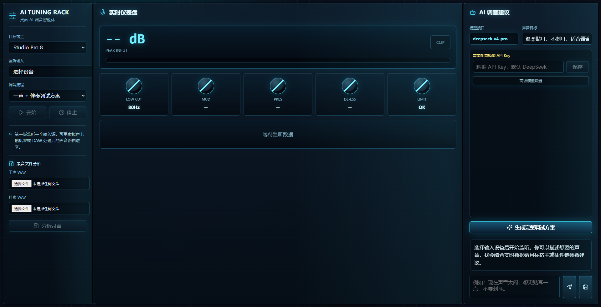

<p align="center">
  
</p>

# Mency AI Tuning Rack

**A Windows desktop AI tuning agent for vocal recording, dry-vocal analysis, and plugin-chain suggestions.**

[](https://github.com/609280054-debug/Mency/releases/download/v0.1.0-preview/Mency-AI-Tuning-Rack-Setup-0.1.0.exe)
[](https://609280054-debug.github.io/Mency/)
[](https://github.com/609280054-debug/Mency/releases/tag/v0.1.0-preview)

Mency AI Tuning Rack helps singers, producers, and home-studio users turn a dry vocal plus backing track into a practical tuning plan. It analyzes the audio, then asks an OpenAI-compatible model to generate plugin-chain guidance, starting parameters, listening checks, and follow-up adjustment ideas.

## Download

- Download page: https://609280054-debug.github.io/Mency/
- Latest release: https://github.com/609280054-debug/Mency/releases/tag/v0.1.0-preview
- Windows installer: https://github.com/609280054-debug/Mency/releases/download/v0.1.0-preview/Mency-AI-Tuning-Rack-Setup-0.1.0.exe
- Portable ZIP: https://github.com/609280054-debug/Mency/releases/download/v0.1.0-preview/AI-Tuning-Rack-win-x64.zip

```text
Installer SHA256: 36097CBF7F4718DC757EDA584DF3A5C3C7D9EF9D476C8441CA39B0AB74E6956B
Portable ZIP SHA256: 15EF1EF48F70B9BC77FBEBF6B245A2E625567BF7F7C6174DD088B1B811D88A17
```

## What It Can Do

- Analyze dry vocal WAV files and backing-track WAV files
- Monitor a real-time Windows audio input
- Generate a professional-style vocal tuning workflow
- Suggest EQ, compression, de-essing, saturation, reverb, delay, and final-check steps
- Support Studio One 6/7/8 style workflows
- Output generic VST chains for Cubase, FL Studio, Ableton Live, and other DAWs
- Connect to DeepSeek or another OpenAI-compatible model API

## Quick Start

1. Download `Mency-AI-Tuning-Rack-Setup-0.1.0.exe`.
2. Run the installer.
3. Launch Mency AI Tuning Rack from the desktop shortcut or Start Menu.
4. Enter your own API key in the model settings area.
5. Upload a dry vocal WAV and a backing WAV, or start real-time monitoring.
6. Type your vocal goal.
7. Generate the tuning plan.
8. Apply the suggested chain inside your DAW.

For beginners, the dry vocal plus backing track workflow is the easiest and most reliable path.

## User Guides

- 中文安装与使用说明: [docs/INSTALL_USAGE_CN.md](docs/INSTALL_USAGE_CN.md)
- English installation and usage guide: [docs/INSTALL_USAGE_EN.md](docs/INSTALL_USAGE_EN.md)

## App Preview

<p align="center">
  
</p>

## API Key Safety

The public release does **not** include a paid API key.

Each user needs to enter their own model API key inside the app. Local settings are stored on the user's computer and are not committed to this repository.

The repository ignores `.env`, and the release package includes only `.env.example`.

## Current Limits

- This preview build is unsigned, so Windows may show an unknown-publisher warning.
- The app gives tuning suggestions; it does not automatically control your DAW or plugins.
- WAV upload is the safest file-based analysis workflow for this preview.
- Real-time monitoring depends on your Windows audio routing, audio interface, or virtual audio cable setup.

## Development

Install dependencies:

```powershell
.\scripts\setup.ps1
```

Start the desktop app in development mode:

```powershell
.\scripts\start.ps1
```

Build the Windows preview package:

```powershell
pnpm run package:win
```

Check the release package:

```powershell
pnpm run check:release
```
